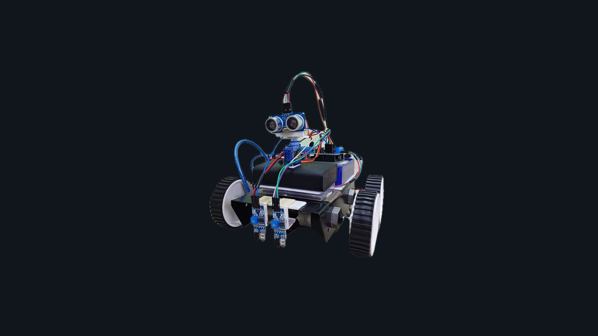

# pathguarduino
 An Arduino-based robotic system engineered for seamless path following while adeptly evading obstacles using sensor technologies.

<br>



<br>

<div align="center">
<p align="center">

</p>


</div>

---

## 📖 Table of Contents
- [📖 Table of Contents](#-table-of-contents)
- [📍 Overview](#-overview)
- [📦 Components](#-components)
- [📂 Repository Structure](#-repository-structure)
- [⚙️ Modules](#-modules)
- [⚡️ Circuit Assembly](#-circuit-assembly)
- [🤖 Getting Started](#-getting-started)
    - [How to Install Arduino IDE on Windows or macOS](#how-to-install-arduino-ide-on-windows-or-macos)
    - [Forking the GitHub Project and Opening in Arduino IDE](#forking-the-github-project-and-opening-in-arduino-ide)
    - [Running the Arduino Script in Arduino IDE](#running-the-arduino-script-in-arduino-ide)
- [🛠️ How does pathguarduino work?](#-how-does-pathguarduino-work)
- [🤝 Contributing](#-contributing)
- [📄 License](#-license)
- [👏 Acknowledgments](#-acknowledgments)


---

## 📍 Overview

The PathGuarduino project represents a sophisticated application of sensor technology encapsulated within an Arduino-based robotic system designed to exemplify precise path following while adeptly navigating obstacles. This project amalgamates advanced infrared and ultrasonic sensors strategically integrated into the robotic framework, enabling seamless line tracking and intelligent obstacle avoidance. With a comprehensive arrangement of IR sensors for line detection and an ultrasonic sensor coupled with a servo motor for obstacle assessment, PathGuarduino showcases an intricate yet efficient fusion of hardware and programming to achieve optimal path traversal and obstacle evasion. This project embodies a harmonious synergy of technology, demonstrating a meticulous exploration of sensor-driven robotics and its practical application in navigation and autonomous movement.

---

## 📦 Components

* Arduino Uno.
* Ultrasonic sensor (Hc-sr04) for obstacle avoidance.
* 2 x IR Sensor for tracing the line.  
* L293D motor driver shield for controlling the motor.
* Servo motor
* 4 x 12V DC motor with wheel.
* Chasis.
* Jumper wires.
* 12V battery and a Powerbank.

---

## 📂 Repository Structure

```sh
└── pathguarduino/
    └── pathguarduino.ino

```

---


## ⚙️ Modules

<details closed><summary>Root</summary>

| File                                                                                               | Summary                   |
| ---                                                                                                | ---                       |
| [pathguarduino.ino](https://github.com/vaidyanathaniyer/pathguarduino/blob/main/pathguarduino.ino) | Source Code File          |

</details>

---
## ⚡️ Circuit Assembly


<br>

Go to (https://github.com/vaidyanathaniyer/pathguarduino/blob/main/pathguarduino.ino) to access the complete source code of the project.

---
## 🤖 Getting Started
### How to Install Arduino IDE on Windows or macOS:

#### For Windows:

* 🌐 Go to the [Arduino official website](https://www.arduino.cc/en/Main/Software) and download the latest Arduino IDE for Windows.
* 🏃‍♀️ Run the installer and follow the on-screen instructions to complete the installation.

#### For macOS:

* 🍏 Go to the [Arduino official website](https://www.arduino.cc/en/Main/Software) and download the latest Arduino IDE for macOS.
* 🏃‍♀️ Open the downloaded `.dmg` file and drag the Arduino application to the Applications folder to install it.

<br>

### Forking the GitHub Project and Opening in Arduino IDE:

#### Using GitHub Desktop App:

* 🌐 Download and install [GitHub Desktop](https://desktop.github.com/) for your operating system.
* 🍴 Open GitHub Desktop and log in with your GitHub account credentials.
* 🌐 Go to the GitHub repository you want to fork: [vaidyanathaniyer/pathguarduino](https://github.com/vaidyanathaniyer/pathguarduino).
* 🍴 Click the "Fork" button in the top right corner of the repository page. This will create a copy of the repository in your GitHub account.
* ✅ Once the forking process is complete, go to GitHub Desktop.
* 🔗 Click on "File" > "Clone Repository" > "URL" and paste the URL of your forked repository.
* 📂 Choose a local directory where you want to clone the repository and click "Clone".

#### Opening in Arduino IDE:

* 🚀 Open Arduino IDE.
* 📂 Click on "File" > "Open" and navigate to the directory where you cloned the repository.
* 📄 Select the Arduino script file (`.ino` file) you want to work with and open it in Arduino IDE.

<br>

### Running the Arduino Script in Arduino IDE:

* 🚀 In Arduino IDE, ensure you have the Arduino Uno board selected under "Tools".
* 🛠️ Choose the appropriate port under "Tools" if it's not automatically selected.
* ▶️ Click the "Upload" button (right arrow icon) to compile and upload the script to your Arduino Uno board.
* 🎉 The script will be uploaded, and you can observe the behavior of your PathGuarduino project.

<br>

🎉 Congratulations! You've successfully installed Arduino IDE, forked the PathGuarduino GitHub repository using GitHub Desktop, opened the project in Arduino IDE, and uploaded the Arduino script to your Arduino Uno board. Enjoy working on your PathGuarduino project!

---
## 🛠️ How does pathguarduino work?

The line-following functionality is facilitated by the utilization of two IR sensors strategically positioned at the front of the robot, directed towards the black line. Emitting infrared rays, these sensors discern the surface: when encountering an ordinary surface, the sensor output registers as Low (0V), but when the IR sensor faces the black line, the absence of reflected infrared rays causes the sensor output to spike to High (+4.5V). One sensor is situated on the front left, while the other is positioned on the front right. When both sensors register as High, the robot proceeds forward. In scenarios where the left sensor records a Low output while the right sensor reads as High, the robot executes a right turn to stay aligned with the line, responding to a designated 'MOVE RIGHT' command.

<br>

Executing a right turn involves the activation of the left-side wheels rotating forward and the right-side wheels moving backward. Conversely, a left turn engages the right-side wheels to rotate forward and the left-side wheels to reverse. This motion is controlled through M1 & M2 for the left wheels and M3 & M4 for the right wheels.

<br>

For obstacle detection, an Ultrasonic Sensor is employed. The sensor's Trigger Pin emits an ultrasonic signal that, upon encountering an obstacle, is reflected and received by the Echo Pin. Utilizing the equation Distance = Velocity of Sound × Time, the Ultrasonic Sensor detects obstacles within a 12 cm range. Mounted on a Servo Motor, the sensor can discern obstacle positions on the left or right side. Consequently, the robot maneuvers away from detected obstacles by moving in the opposite direction. The Servo Motor undergoes a zero to 90-degree rotation on both sides to ascertain the distance of obstacles on either side.

<br>

Acting as an intermediary between the Arduino Uno and the 12V DC Motors, the Motor Shield safeguards the Arduino Uno from potential damage resulting from the higher power draw of the DC Motors. It delivers regulated DC to the motors, controlling the motor speed through Pulse Width Modulated DC Voltage Output.

---
## 🤝 Contributing
Contributions are always welcome! Please follow these steps:

1. Fork the project repository. This creates a copy of the project on your account that you can modify without affecting the original project.
2. Clone the forked repository to your local machine using a Git client like Git or GitHub Desktop.
3. Create a new branch with a descriptive name (e.g., `new-feature-branch` or `bugfix-issue-123`).

```sh
git checkout -b new-feature-branch
```

4. Make changes to the project's codebase.
5. Commit your changes to your local branch with a clear commit message that explains the changes you've made.

```sh
git commit -m 'Implemented new feature.'
```

6. Push your changes to your forked repository on GitHub using the following command

```sh
git push origin new-feature-branch
```

7. Create a new pull request to the original project repository. In the pull request, describe the changes you've made and why they're necessary.
   The project maintainers will review your changes and provide feedback or merge them into the main branch.

---

## 📄 License

This project is licensed under the **MIT License**. See the [MIT License](LICENSE) file for additional information.

[↑ Return](#Top)

---